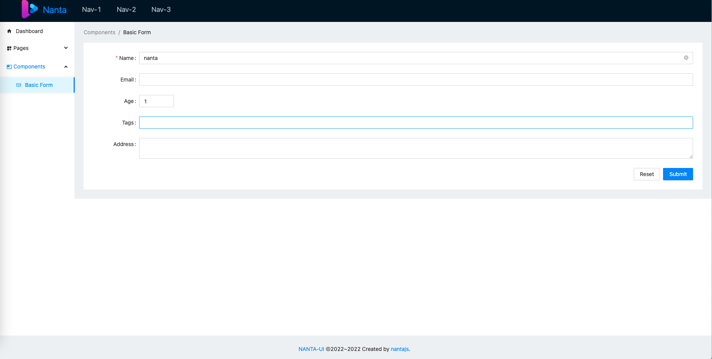

# nanta-ui

 <p>
     <a href="https://github.com/aborn/mindpress/actions/workflows/docs.yml"></a>
     <a href="https://www.npmjs.com/package/@nanta/ui"></a>
     <a href="https://www.npmjs.com/package/@nanta/ui"></a>
     <a href="https://www.npmjs.com/package/@nanta/ui"></a> 
</p>

Ant-design based UI framework.



## Features
- Schema-style form/table design.  
- Light-weight ui component library.  
- Type-scipt support.  
- Support vue 3 and nuxt 3.  
- Vite support.  

## Deps

- Vue 3.0
- [ant-design-vue](https://github.com/vueComponent/ant-design-vue)  
- Lodash

## Setup

1. Install **nanta-ui**

```shell
yarn add @nanta/ui
yarn install
```

2. Configure
- **Vue 3** framework   
  Install Antd plugin in `main.ts`
```js
import Antd from 'ant-design-vue';
import 'ant-design-vue/dist/antd.css';
createApp(App).use(Antd).mount('#app')
```

Here is an example in `docs`, and another example [nanta-ui-vue](https://github.com/nantajs/nanta-ui-vue):   
```shell
yarn docs
```

- **Nuxt 3** framework  
  Auto-install Antd plguin, create `nantaui.ts` in `<projectDir>/plugins/` with the following boilerplate:  
```js
// plugins/nantaui.ts
import { defineNuxtPlugin } from '#app'
import Antd from 'ant-design-vue';
import 'ant-design-vue/dist/antd.css';

export default defineNuxtPlugin(nuxtApp => {
  nuxtApp.vueApp.use(Antd)
})
```
Here is an exmple [nanta-ui-nuxt](https://github.com/nantajs/nanta-ui-nuxt)

## Notice

This project still in alpha stage, you can try it in non-production environment.

## How to dev

1. build package

```shell
yarn package
```

2. test pkg in local

```shell
yarn pack  # pack local
npm install nanta-ui-v0.1.0-alpha.1.tgz  # install local
```

3. publish to npm
Remove nanta-ui && local deps befor publish it.

```shell
npm publish --access public
```
